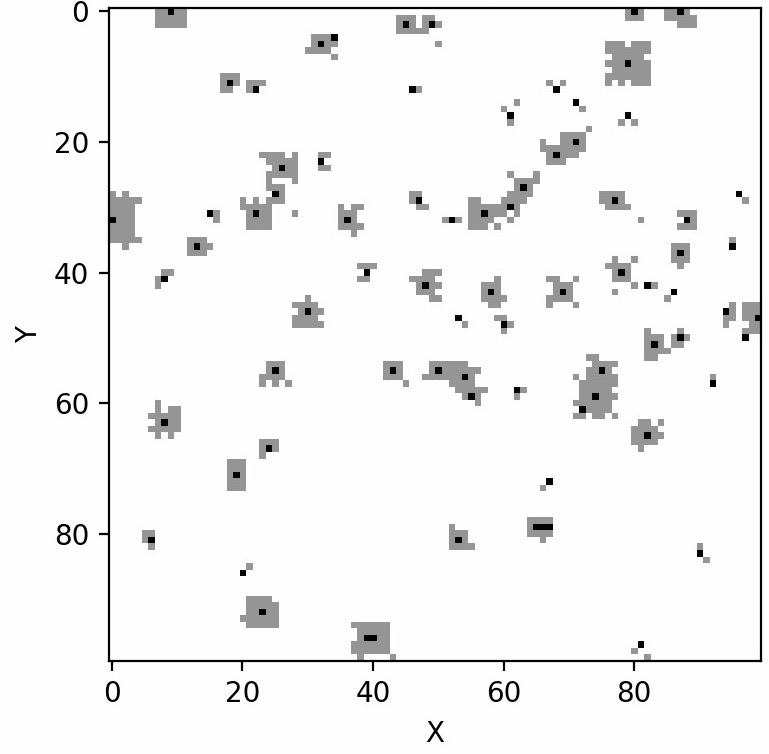
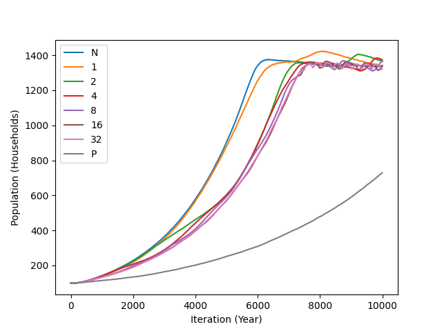
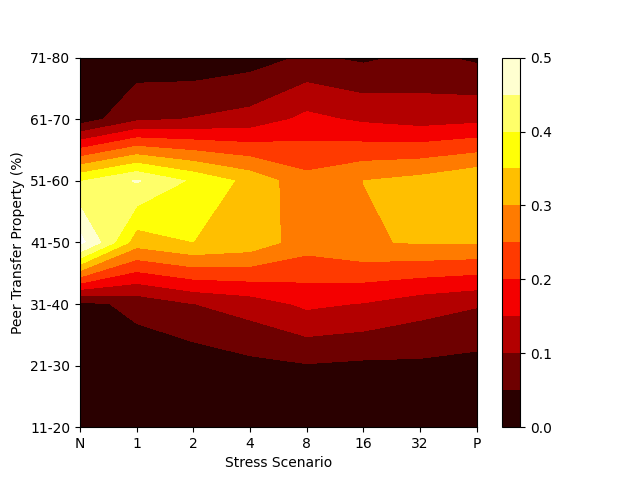
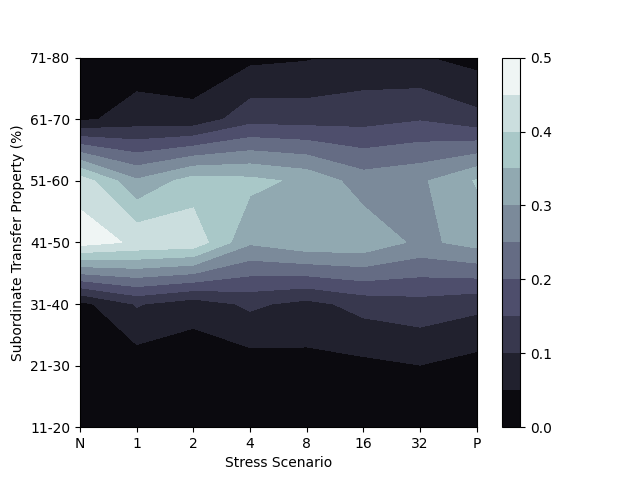
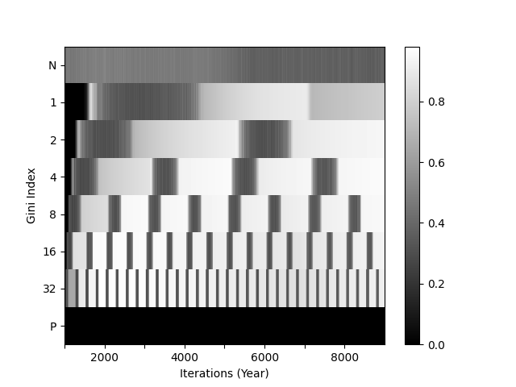
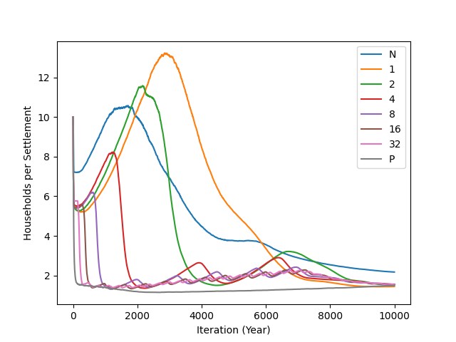
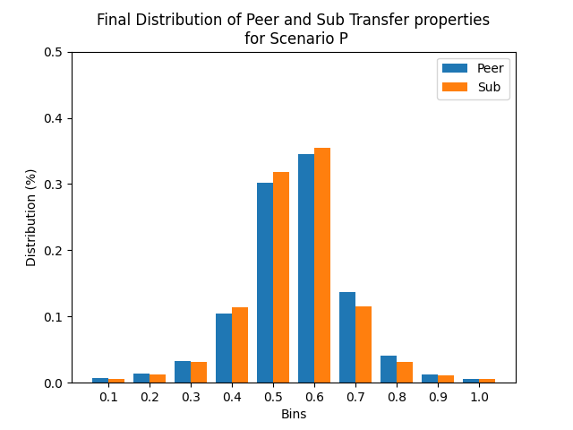

# NeoCOOP: Neolithic Agent Cooperation Model
NeoCOOP is an agent-based model (ABM) designed to simulate the emergence and evolution of altruistic and selfish 
behaviour in Neolithic Households under varying degrees of environmental stress.

An ODD+D [[Müller et al., 2013]](https://www.sciencedirect.com/science/article/pii/S1364815213001394) description plus additional model details have been included in [Supplementary Materials.pdf](./Supplementary%20Materials.pdf)

## Installation

**Note:** This document assumes you are using a UNIX-based OS.

To use NeoCOOP, first clone the repo and navigate to the *ABM-gecco2022* directory using your favourite terminal application.
We first need to create a virtual environment for NeoCOOP and we do so by typing:

`> make`

into your terminal. That should create a virtual environment with all the necessary modules needed to run NeoCOOP.
Next activate the virtual environment by typing:

`> source ./venv/bin/activate`

Once that is complete we can compile the Cython code used in NeoCOOP with:

`> make compile`

This will create several *.so* files that NeoCOOP will make use of.

## Running a Single Simulation:

To run an instance of NeoCOOP, first make sure you have installed all of the neccessary modules and have the virtual environment activated.

We run a single instance of NeoCOOP by typing the following into your terminal:

`> python3 src/main.py -f path/to/decoder [-lrb basename] [--frequency n]`

- *-f* specifies the path to the decoder folder used to customize the initial parameters of NeoCOOP. Several have already been provided under `/resources`
- *-l* specifies that you would like to log all System Actions to a file called: *events.log*
- *-r* specifies that you would like record snapshots of the environment, settlements and agents
- *-b* specifies the base folder name of the recorded snapshots. The default value is: *base*
- *--frequency* specifies the frequency at which snapshots are recorded. The default value is: 1

## Visualizing a Single Simulation:

To visualize a recorded simulation, use the following command:

`> python3 ./src/main_vis.py ./path/to/base/file 100 100`

where the base file is the directory generated by running the simulation.

**Note:** This process may take a while as a variety of plots and gifs are created.

## Running Multiple Simulations at Once:

To run multiple simulations at once, run the following command:

`> ./batchrunner.sh ./path/to/decoder/ /path/to/output/folder`

The first argument is the same as the *-f* argument when running a single simulation and the second argument
should be an empty directory where all the simulations will record their data to (Arranged by seed value).

Note: You can add / remove any seeds from the seed list as well as modify the number of
simulations that can run at any one time (Look inside *batchrunner.sh*)

## Processing Batch Simulations:

To process batch simulations, run the following:

`> python3 src/collected_data_processor.py -p paths -o output_folder`

This will create a series of JSON files will all of a batch simulations useful information.

## Plotting Graphs:

While the data processed by `collected_data_processor.py` can be used to create plots of your liking,
we do include a script `graph_plotter.py` that will produce a wide variety of graphs of interest:

`> python3 src/graph_plotter.py -p path_to_processed_data -o output_folder -s none`

This will produce graphs of agent resource trading beliefs, population levels, inequality, and settlement density:

Agent Populations:

Resource Trading Beliefs:

Gini Heatmap:

Settlement Density:

Another look at the final Resource Trading Beliefs for one scenario:
